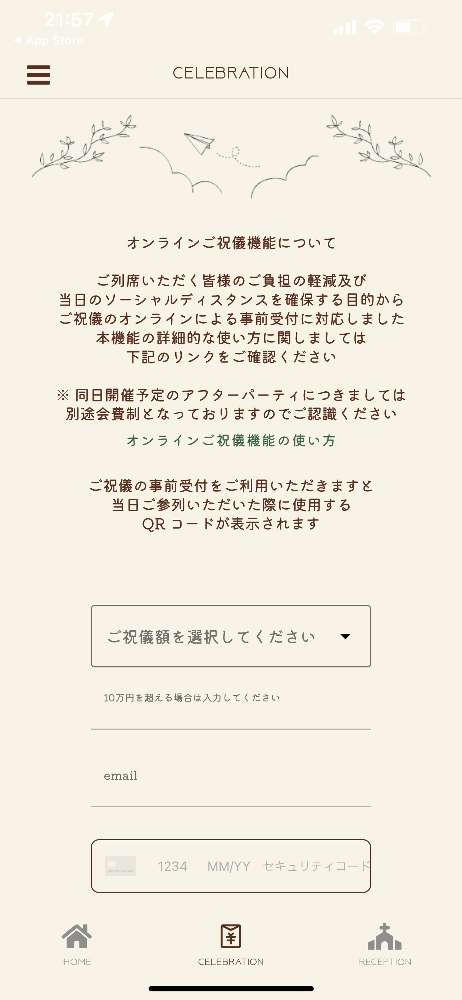

# サポートページ（ iOS 端末をお使いの方）

## アプリの使い方

### 各画面の説明

429-WEDDING は以下の画面で構成されています（主な画面のみ掲載、随時機能追加予定）
* LOGIN 画面
* HOME 画面
* CELEBRATION 画面
* RECEPTION 画面
* PROFILE 画面

下記の画面はログイン後のホーム画面から `フッタータブ` をタップすることで切り替えることができます

* `HOME` : HOME 画面
* `CELEBRATION` : CELEBRATION 画面
* `RECEPTION` : RECEPTION 画面

下記の画面はログイン後の画面から `ハンバーガーメニュー` をタップして選択することで切り替えることができます

* `Profile` : PROFILE 画面

### ログイン画面

429-WEDDING にログインするための画面です  
`id` と `password` を入力し `LOGIN` をタップすることでログインできます  
初期の `id` と `password` は新郎新婦よりお伝えしているものを入力してください

#### 初回ログイン時
初回ログイン時に、`お名前登録モーダル` と `パスワード変更モーダル` が表示されます   
それぞれ入力をお願いいたします

### HOME 画面

挙式披露宴へのご出席ご欠席を表明いただける画面です  
`出席` もしくは `欠席` をタップすることで表明いただけます  

`出席` をタップしていただけると喜びます

なお、注意メッセージが表示されますが、一度表明いただくと変更はできませんのでお気をつけください  
もし誤って表明された場合は新郎新婦まで直接ご連絡ください  

また、会場の __新型コロナウイルスの感染予防及び拡散防止対策__ につきましては、 `感染症予防対策について` もしくは `ご列席される方にお願い（動画）` をタップいただくことでご確認いただけます

同日に __アフターパーティ__ を開催する予定です  
こちらにつきましては、挙式披露宴へのご出席ご欠席を表明いただいた後に表示される `アフターパーティについて` をタップして頂き、別途参加不参加の表明をお願いいたします

### CELEBRATION 画面

ご祝儀をオンライン決済にて包んでいただける画面です  
ご祝儀の金額は予め用意されている選択肢から選択いただけます    
（ 10 万円を超える場合は、直接ご入力ください）

オンライン決済システムの都合上 `email` にメールアドレスを入力頂く必要があります  
オンライン決済システムには [stripe](https://stripe.com/jp) というサービスを利用させていただいており、お預かりしたメールアドレスは stripe 内でのみ保管させていただきます  
詳しくは [プライバシーポリシー](./../privacy-policy.md) をご確認ください

429-WEDDING のオンライン決済は __クレジットカードのみ__ に対応しております  
クレジットカード情報の入力欄には、下記の順に一行で続けてご入力ください

* カード番号
* 利用期限（ 月/年 の順）
* セキュリティコード（カード裏の３桁の数字）

ご祝儀金額の選択、メールアドレスの入力、クレジットカード情報の入力のすべてが完了すると `お気持ちをお届けする` ボタンがタップできるようになります  

ボタンをタップすると確認メッセージが表示されるので、内容を再度ご確認いただき問題なければ `同意する` をタップしてください  
`お届け` ボタンがタップできるようになるので、こちらをタップいただくことでご祝儀をお預かりします

### RECEPTION 画面

挙式披露宴の日時、場所、タイムラインをご確認いただける画面です

### PROFILE 画面

お名前やパスワードの変更を行える画面です

__お名前の変更手順__
1. `表示されているお名前` をタップします
2. お名前の変更モーダルが表示されるので、 `姓` と `名` を入力します
3. `変更` をタップします

__パスワードの変更手順__
1. password の横の `編集アイコン` をタップします
2. パスワードの変更モーダルが表示されるので、`現在のパスワード` と `新しいパスワード` 、 `（確認用）新しいパスワード` を入力します
3. `変更` をタップします

## その他、なにか困ったときは、、。

バグだと思われる不審な挙動をした際やアプリの使い方で困ったことなどあれば、何なりと新郎新婦までご連絡ください  
アプリの使用中も挙式披露宴当日もゲストの皆様には楽しんでいただけるよう全力でご対応させていただきます

何卒よろしくお願いいたします